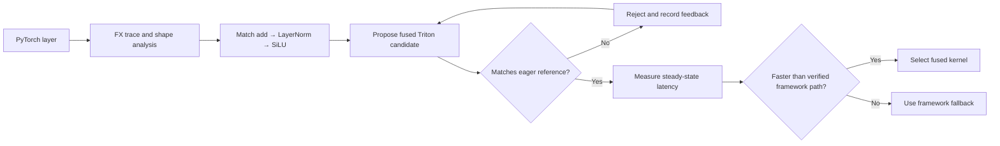
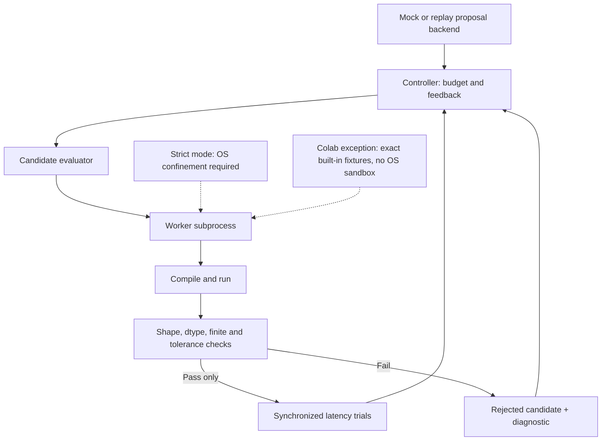

# KernelRelay

KernelRelay is a small, reproducible PyTorch-to-Triton compiler experiment. It finds one fusion opportunity in a PyTorch FX graph, tests kernel proposals against eager PyTorch, measures the correct implementations on a GPU, and keeps the fastest verified path—or falls back safely.

The workload is `SiLU(LayerNorm(x + input_bias, weight=gamma, bias=beta))`. This is an **independent research prototype for one operator cluster**, not a general-purpose compiler or a production sandbox.

## How it works



There are two related entry points:

| Entry point | What it demonstrates |
| --- | --- |
| [`agentic_kernel_compiler.py`](agentic_kernel_compiler.py) | A self-contained compiler loop that searches 36 launch configurations for one fused kernel body. |
| [`agent_eval.py`](agent_eval.py) | A bounded proposal/evaluation loop with compile errors, correctness checks, timing, feedback, rewards, and a JSON trajectory. Its built-in agent is **deterministic mock code**, not a language model. |

The proposal evaluator normally requires OS filesystem confinement. The Colab T4 used for the published V2 measurements did not expose Landlock, so those runs used an explicit **exact-fixture-only mode with no OS sandbox**. Arbitrary or replayed source is not accepted in that mode. See [architecture and security limits](docs/AGENT_EVALUATION.md).

## Try it locally

Python and PyTorch are required. Triton is optional; the CPU path does not import it at startup.

```bash
python3 -m venv .venv
source .venv/bin/activate
python3 -m pip install torch
python3 agentic_kernel_compiler.py --quick
python3 agent_eval.py --device cpu --agent mock --max-rounds 3 --quick
python3 -m unittest -q
```

On CPU, optimization paths are explicitly labeled as fallbacks. CPU timings are not predictions of GPU performance. The V2 evaluator defaults to strict OS confinement; if your host lacks it, the built-in mock can be smoke-tested with `--trusted-fixture-colab`, which is an explicit **no-OS-sandbox** exception and must never be used for arbitrary source. For a real NVIDIA run, follow the [Colab GPU workflow](colab/README.md); it checks the assigned GPU and records the environment in each trace.

## What was measured

On one Google Colab Tesla T4, an 8192 × 128 FP16 task passed eight correctness cases for each measured finalist. A same-process confirmation interleaved five rounds of eager, Inductor default, and two fused kernels, with 100 warmups and 100 CUDA-event timing samples per path per round:

| Path | Median of round medians |
| --- | ---: |
| Eager PyTorch | 0.119824 ms |
| `torch.compile` / Inductor default | 0.140480 ms |
| Fused candidate 2 | 0.055312 ms |
| Fused candidate 3 | **0.053088 ms** |

The best fused median was **2.257×** faster than the best framework median in that confirmation. Three separate full evaluations also selected a verified fused candidate, but framework baseline timing drifted appreciably; this is a *recorded T4 result*, not a universal speedup or a statistical confidence interval. The experiment did not measure physical HBM bandwidth. [Read the methodology, limitations, and path-normalized public records](results/agent-eval/README.md). The earlier [configuration-search T4 records](results/t4/README.md) are a separate experiment and must not be conflated with the proposal loop.

## Evaluation boundary



This separation matters: eager PyTorch is the numerical oracle, invalid candidates never receive a positive speedup, compilation is excluded from steady-state timing, and a verified framework implementation remains the fallback.

## Scope and limitations

- One inference workload; no backward kernel, dynamic-shape generality, multi-vendor backend, or production deployment claim.
- The V1 path tunes a handwritten kernel. The V2 mock backend supplies predefined source proposals; it does **not** demonstrate a frontier model learning to write kernels.
- Analytical FLOP and byte estimates are models, not hardware-counter readings. GPU timings depend on device, software versions, clock state, and measurement protocol.
- Strict isolation is not a complete hostile-code sandbox. The Colab trusted-fixture exception has **no OS sandbox** and must not be used for arbitrary source.

## Project map

- [Technical walkthrough](docs/TECHNICAL_WALKTHROUGH.md)
- [Agent evaluation architecture](docs/AGENT_EVALUATION.md)
- [Reproduction guide](docs/REPRODUCING.md)
- [T4 result records](results/agent-eval/README.md)
- [Specification](SPEC.md)
- [Contributing](CONTRIBUTING.md) · [Security](SECURITY.md) · [License](LICENSE)

The project is released under the MIT license. The LayerNorm reduction design was informed by the [official Triton LayerNorm tutorial](https://triton-lang.org/main/getting-started/tutorials/05-layer-norm.html); see [acknowledgments](docs/ACKNOWLEDGMENTS.md).
