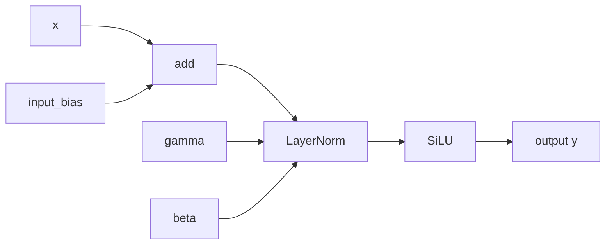
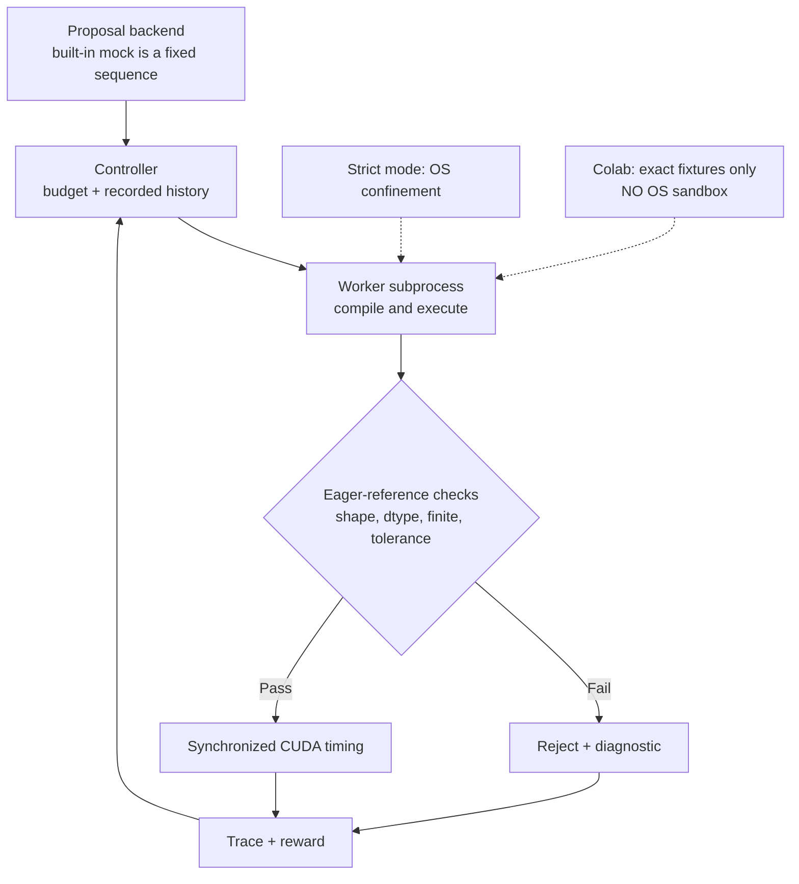

# KernelRelay

[](https://github.com/pkarakala/kernel-relay/actions/workflows/ci.yml)

I built KernelRelay to answer a narrow question: can a compiler loop find a useful fusion in a PyTorch graph, reject wrong kernels, and demonstrate a real GPU win against verified framework paths? The test case is `SiLU(LayerNorm(x + input_bias, weight=gamma, bias=beta))`.

On one Colab Tesla T4, the fastest verified fused finalist took **0.053 ms versus 0.120 ms for the best framework path (2.26×)** in a same-process confirmation. The proposal backend in this experiment is a **fixed mock sequence**, not an LLM. [The full measurements and timing drift are published](results/agent-eval/README.md).

The interesting work was in the evaluation harness: an invalid proposal had to fail visibly, Colab returned `ENOSYS` for Landlock, a sanitized worker initially lost access to the NVIDIA driver library, and separate-process timings drifted enough to warrant an interleaved finalist check. Those failures shaped the correctness gates, explicit trust mode, and benchmark protocol.

## The fusion target



The FX matcher checks the actual graph edges, tensor roles, shapes, and epsilon before treating this chain as fusible. Eager PyTorch can materialize the add and LayerNorm intermediates; the supported Triton path uses one program per row, accumulates the normalization statistics in FP32, and writes only the final output to global memory.

There are two related entry points:

| Entry point | What it demonstrates |
| --- | --- |
| [`agentic_kernel_compiler.py`](agentic_kernel_compiler.py) | A self-contained compiler loop that searches 36 launch configurations for one fused kernel body. |
| [`agent_eval.py`](agent_eval.py) | A bounded source-proposal evaluation loop with compile errors, correctness checks, timing, rewards, and a JSON trajectory. The supplied mock agent emits predefined candidates. |

One recorded full T4 run shows the deliberately malformed first fixture being rejected and a later candidate being measured (condensed from the [terminal log](results/agent-eval/v2-full-t4-fp16.log) and [verification trace](results/agent-eval/v2-full-t4-fp16.json); latency rounded here):

```text
round 0  compile_error  SyntaxError: invalid syntax
round 2  measured       0.057248 ms, passed eight correctness cases
```

The mock sequence is fixed; it does **not** choose its next proposal by reasoning over the error. The controller still records that error and supplies history to the proposal interface, so a future adaptive backend could use it. The Colab run used an explicit exact-fixture-only mode because Landlock was unavailable; that mode has **no OS sandbox** and rejects replay or arbitrary source. [Architecture and security details](docs/AGENT_EVALUATION.md).

## Try it locally

Python and PyTorch are required. Triton is optional; the CPU path does not import it at startup.

```bash
python3 -m venv .venv
source .venv/bin/activate
python3 -m pip install torch
python3 agentic_kernel_compiler.py --quick
python3 agent_eval.py --device cpu --agent mock --max-rounds 3 --quick
python3 -m unittest -q
```

On CPU, optimization paths are explicitly labeled as fallbacks. CPU timings are not predictions of GPU performance. The V2 evaluator defaults to strict OS confinement; if your host lacks it, the built-in mock can be smoke-tested with `--trusted-fixture-colab`, which is an explicit **no-OS-sandbox** exception and must never be used for arbitrary source. For a real NVIDIA run, follow the [Colab GPU workflow](colab/README.md); it checks the assigned GPU and records the environment in each trace.

## What was measured

On one Google Colab Tesla T4, an 8192 × 128 FP16 task passed eight correctness cases for each measured finalist. A same-process confirmation interleaved five rounds of eager, Inductor default, and two fused kernels, with 100 warmups and 100 CUDA-event timing samples per path per round:

| Path | Median of round medians |
| --- | ---: |
| Eager PyTorch | 0.120 ms |
| `torch.compile` / Inductor default | 0.140 ms |
| Fused candidate 2 | 0.055 ms |
| Fused candidate 3 | **0.053 ms** |

The best fused median was **2.26×** faster than the best framework median in that confirmation. Three separate full evaluations also selected a verified fused candidate, but framework baseline timing drifted appreciably. This is a measured result on one T4, not a universal speedup or a confidence interval; no physical HBM bandwidth counters were collected. [Exact timings, protocol, and path-normalized public records](results/agent-eval/README.md). The earlier [configuration-search T4 records](results/t4/README.md) are a separate experiment.

## Evaluation boundary



The arrow back to the controller represents recorded feedback and another bounded round—not learning by the supplied mock. A candidate is timed only after passing eager-reference checks; compilation stays outside steady-state timing, and a verified framework path remains the fallback.

## Scope and limitations

- One inference workload; no backward kernel, dynamic-shape generality, multi-vendor backend, or production deployment claim.
- The V1 path tunes a handwritten kernel. The V2 mock backend supplies predefined source proposals; no frontier-model optimization or training is demonstrated.
- Analytical FLOP and byte estimates are models, not hardware-counter readings. GPU timings depend on device, software versions, clock state, and measurement protocol.
- Strict isolation is not a complete hostile-code sandbox. The Colab trusted-fixture exception has **no OS sandbox** and must not be used for arbitrary source.

## Project map

- [Technical walkthrough](docs/TECHNICAL_WALKTHROUGH.md)
- [Agent evaluation architecture](docs/AGENT_EVALUATION.md)
- [Reproduction guide](docs/REPRODUCING.md)
- [T4 result records](results/agent-eval/README.md)
- [Specification](SPEC.md)
- [Contributing](CONTRIBUTING.md) · [Security](SECURITY.md) · [License](LICENSE)

The project is released under the MIT license. The LayerNorm reduction design was informed by the [official Triton LayerNorm tutorial](https://triton-lang.org/main/getting-started/tutorials/05-layer-norm.html); see [acknowledgments](docs/ACKNOWLEDGMENTS.md).
